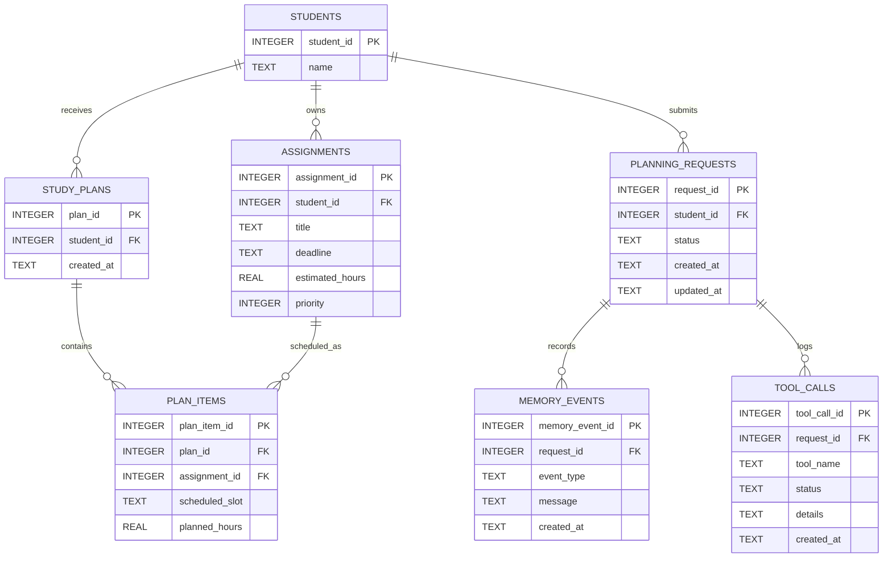

# Relational Schema Model 

 

```mermaid 

erDiagram 

    STUDENTS { 

        INTEGER student_id PK 

        TEXT name 

    } 

    ASSIGNMENTS { 

        INTEGER assignment_id PK 

        INTEGER student_id FK 

        TEXT title 

        TEXT deadline 

        REAL estimated_hours 

        INTEGER priority 

    } 

    PLANNING_REQUESTS { 

        INTEGER request_id PK 

        INTEGER student_id FK 

        TEXT status 

        TEXT created_at 

        TEXT updated_at 

    } 

    STUDY_PLANS { 

        INTEGER plan_id PK 

        INTEGER student_id FK 

        TEXT created_at 

    } 

    PLAN_ITEMS { 

        INTEGER plan_item_id PK 

        INTEGER plan_id FK 

        INTEGER assignment_id FK 

        TEXT scheduled_slot 

        REAL planned_hours 

    } 

    MEMORY_EVENTS { 

        INTEGER memory_event_id PK 

        INTEGER request_id FK 

        TEXT event_type 

        TEXT message 

        TEXT created_at 

    } 

    TOOL_CALLS { 

        INTEGER tool_call_id PK 

        INTEGER request_id FK 

        TEXT tool_name 

        TEXT status 

        TEXT details 

        TEXT created_at 

    } 

    STUDENTS ||--o{ ASSIGNMENTS : owns 

    STUDENTS ||--o{ PLANNING_REQUESTS : submits 

    STUDENTS ||--o{ STUDY_PLANS : receives 

    STUDY_PLANS ||--o{ PLAN_ITEMS : contains 

    ASSIGNMENTS ||--o{ PLAN_ITEMS : scheduled_as 

    PLANNING_REQUESTS ||--o{ MEMORY_EVENTS : records 

    PLANNING_REQUESTS ||--o{ TOOL_CALLS : logs 

``` 

 

This model is implemented by `db/schema.sql`. 