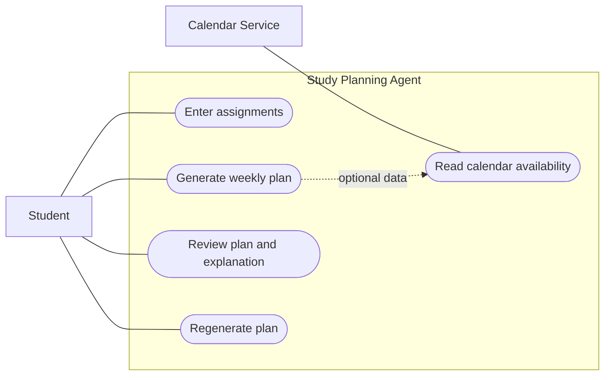

# Use Case Diagram

The following use-case diagram shows the main interactions between the Student, the Study Planning Agent, and the external Calendar Service.

```mermaid
flowchart LR
 Student["Student"]
 Calendar["Calendar Service"]
 subgraph SPA["Study Planning Agent"]
 UC1(["Enter assignments"])
 UC2(["Generate weekly plan"])
 UC3(["Review plan and explanation"])
 UC4(["Regenerate plan"])
 UC5(["Read calendar availability"])
 end
 Student --- UC1
 Student --- UC2
 Student --- UC3
 Student --- UC4
 Calendar --- UC5
 UC2 -. optional data .-> UC5
```